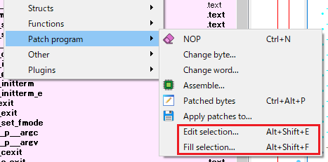
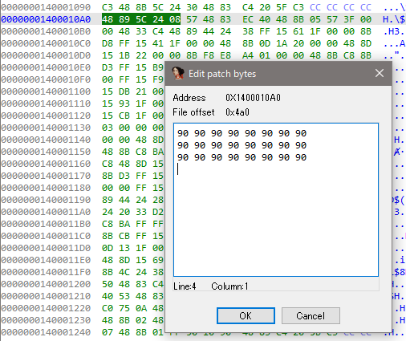
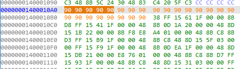
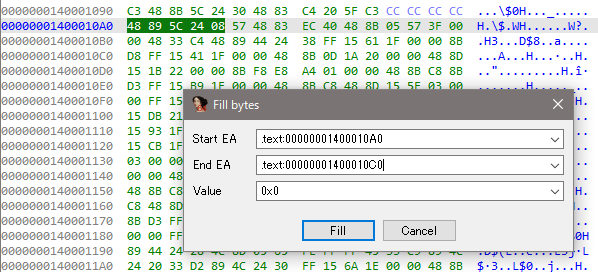
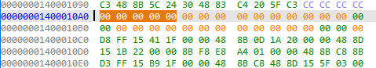

## IDA Patcher (Mini)

IDA Patcher (Mini) is a ported version of [IDA Patcher](https://github.com/iphelix/ida-patcher) to IDA Pro 7.7. 

The original tool is a plugin for Hex-Ray's IDA Pro disassembler designed to enhance IDA's ability to patch binary files and memory. The plugin is useful for tasks related to malware analysis, exploit development as well as bug patching. IDA Patcher blends into the standard IDA user interface through the addition of a subview and several menu items.

## Requirement

* IDA Pro 7.7

## Install

Copy 'idapatcher.py' to IDA's plugins folder. The plugin will be automatically loaded the next time you start IDA Pro.

## Usage

### Edit binary data

* Set the cursor to any position.
* Select `'Edit'` -> `'Patch program'` -> `'Edit selection'`.
* Input hex data in the form. (**The length isn't limited.**)
* Press 'OK'.

* Overwritten with patched data.

### Fill binary data

* Set the cursor to any position.
* Select `'Edit'` -> `'Patch program'` -> `'Fill selection'`.
* Input start address, end address, and new value in the form.
* Press 'Fill'.

* Overwritten with patched data.

## Copyright
* Copyright (C) 2014 Peter Kacherginsky
* Copyright (C) 2022 Hiroki Hada
* All rights reserved.

